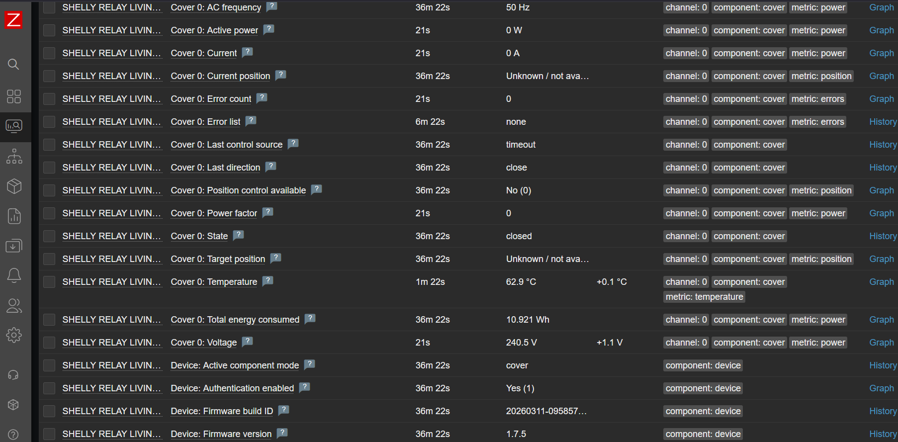

# Shelly 2PM Gen4 Zabbix Template

[](https://www.zabbix.com/)
[](https://www.shelly.com/)
[](LICENSE)

A clean, local **Zabbix 7.4** template for monitoring **Shelly 2PM Gen4** devices through the Shelly HTTP RPC API.

It supports both common operating modes:

- **Switch mode**: `switch:0` and `switch:1`
- **Cover / door / blind mode**: `cover:0`

No Shelly Cloud dependency. Just Zabbix, HTTP, and your local network.

## Screenshot


## What it monitors

- Reachability and no-data state
- Wi-Fi RSSI, SSID, and IP address
- Device model, firmware, and update availability
- Uptime, RAM, and filesystem status
- Switch channel power, voltage, current, frequency, energy, and temperature
- Cover state, direction, power, voltage, current, frequency, energy, temperature, and optional position
- Physical input states: `input:0` and `input:1`

## Repository layout

```text
.
├── README.md
├── LICENSE
├── CHANGELOG.md
├── CONTRIBUTING.md
└── templates/
    └── shelly-2pm-gen4-zabbix-7.4.json
```

## Requirements

- Zabbix 7.4
- Shelly 2PM Gen4, or a compatible Shelly Gen2+/Gen4 RPC device
- Network access from Zabbix server or proxy to the Shelly device
- HTTP(S) access enabled on the Shelly device

## Install

1. Download this repository or clone it.
2. In Zabbix, open **Data collection → Templates → Import**.
3. Import:

   ```text
   templates/shelly-2pm-gen4-zabbix-7.4.json
   ```

4. Open or create a host for your Shelly device.
5. Link the template:

   ```text
   Shelly 2PM Gen4
   ```

6. Add the required host macros below.

## Cybersecurity practices
- By default Shelly devices use plaintext port TCP/80 for HTTP traffic to reach the GUI or API. This means communication with the Shelly device is left unencrypted, which is not preferable (poor pandas whose are always listening... 🐼)
- Setup TLS in Shelly device and use that scheme for macros
- The macros used by this extension specifically `{$SHELLY_USER}` and `{$SHELLY_PASS}` are masked only on Zabbix GUI, yet in the config backup file it's stored unencrypted, make sure not commit backup to any version control or ticketing system without further protection (e.g.: AES-256 protected archive with strong password, with complex password and safe store of password)
- By design some of the Shelly API calls are left unauthenticated (f.e.: `Shelly.GetDeviceInfo`), which means you need to segregate the Shelly devices into their separate network segments, protect them with firewall ACL's and monitor access to Shelly devices. Word of caution: such segmentation may break the mobile app integration with segregated Shelly devices!

## Required host macros

Set these on each Shelly host.

| Macro | Example | Description |
|---|---:|---|
| `{$SHELLY_HOST}` | `192.168.1.50` | Shelly IP or DNS name only, without `https://` |
| `{$SHELLY_USER}` | `admin` | Shelly HTTP username |
| `{$SHELLY_PASS}` | `mySecretPassword` | Shelly HTTP password, stored as secret text |

The template builds the URLs like this (use http only if TLS is not supported) :

```text
https://{$SHELLY_HOST}/rpc/Shelly.GetStatus
https://{$SHELLY_HOST}/rpc/Shelly.GetDeviceInfo
```

So use this:

```text
{$SHELLY_HOST}=192.168.1.50
```

Not this:

```text
{$SHELLY_HOST}=http://192.168.1.50
```

## Tunable settings

These macros are optional. Override them per host when needed.

| Macro | Default | Description |
|---|---:|---|
| `{$SHELLY.INTERVAL}` | `60s` | Main polling interval for `Shelly.GetStatus` |
| `{$SHELLY.NODATA.TIME}` | `5m` | Time without data before the unreachable trigger fires |
| `{$SHELLY.RSSI.MIN}` | `-70` | Minimum acceptable Wi-Fi RSSI in dBm |
| `{$SHELLY.TEMP.MAX}` | `75` | Maximum acceptable relay / cover temperature in °C |
| `{$SHELLY.POWER.MAX.CH0}` | `2300` | Maximum power threshold for switch channel 0 in W |
| `{$SHELLY.POWER.MAX.CH1}` | `2300` | Maximum power threshold for switch channel 1 in W |
| `{$SHELLY.POWER.MAX.COVER}` | `2300` | Maximum power threshold for cover / door motor in W |

## Use

After import and macro setup:

1. Go to **Monitoring → Hosts**.
2. Open your Shelly host.
3. Check **Latest data**.
4. Search for:

   ```text
   Shelly
   Channel
   Cover
   Input
   WiFi
   ```

For a normal dual-relay setup, use the **Channel 0** and **Channel 1** items.

For a door, shutter, blind, or roller setup, use the **Cover 0** items. In cover mode, Channel 0/1 items can stay empty because the device exposes `cover:0` instead of `switch:0` and `switch:1`.

Suggestion: add ICMP template to the given Shelly device to have multiprotocol monitor suppor, not just HTTP. Since this template relies on HTTP no-data detection. A complementary ICMP ping item would distinguish "device unreachable on network" from "HTTP service down / auth failure", which can be useful for diagnosing issues faster.

## Authentication

The template uses **Digest authentication** for the HTTP agent master items. This is needed for protected Shelly RPC calls such as `Shelly.GetStatus`.

If `Shelly.GetDeviceInfo` works but `Shelly.GetStatus` returns `401`, check:

- `{$SHELLY_USER}`
- `{$SHELLY_PASS}`
- the password in the Shelly web UI
- that the host item still uses Digest authentication after import

## Common notes

### Cover position shows Unknown

`current_pos` and `target_pos` are optional Shelly fields. They are usually available only after cover calibration, and `target_pos` may exist only while the cover is moving to a requested position.

This template maps missing cover position values to:

```text
Unknown / not available
```

### Physical buttons are not Channel 0/1

- `switch:0` / `switch:1` are output channels in switch mode.
- `cover:0` is the cover / door / blind component in cover mode.
- `input:0` / `input:1` are the physical wall switch or button inputs.


## Compatible devices

This template is designed for Shelly Gen2+/Gen3/Gen4 devices using the local RPC API and exposing either:

- `switch:0` + `switch:1` for two-channel switch mode
- `cover:0` for cover / shutter / door mode

### Expected to work

| Device | Status | Notes |
|---|---|---|
| Shelly 2PM Gen4 | Tested target | Switch mode and cover mode support |
| Shelly 2PM Gen3 | Expected compatible | Same switch/cover profile model |
| Shelly Plus 2PM | Expected compatible | Same two-channel switch / single-cover profile model |
| Shelly Pro 2PM | Expected compatible | DIN-rail version with switch/cover profiles |

### Partial / future support

| Device | Status | Notes |
|---|---|---|
| Shelly Pro Dual Cover PM | Partial | Should work for `cover:0`; template needs extension for `cover:1` |

### Not intended for

- Gen1 Shelly devices such as Shelly 2.5, because they use the older Gen1 HTTP API model.
- Single-channel PM devices such as Shelly 1PM / Plus 1PM / 1PM Gen3, unless the template is simplified for `switch:0` only.
- Dimmer, RGBW, Plug, EM, Pro 4PM, or other devices exposing different component types.

## License

MIT — see [LICENSE](LICENSE).
